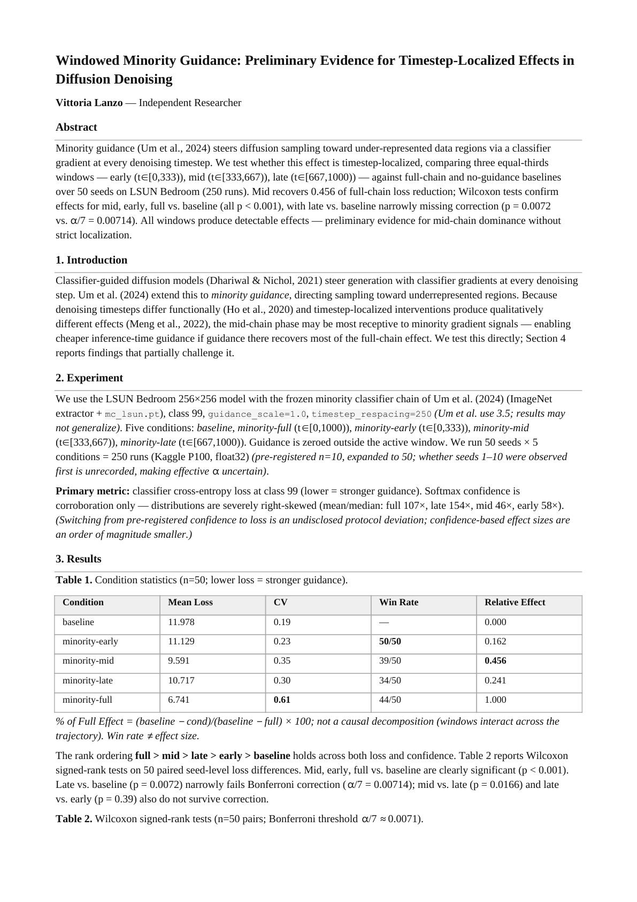
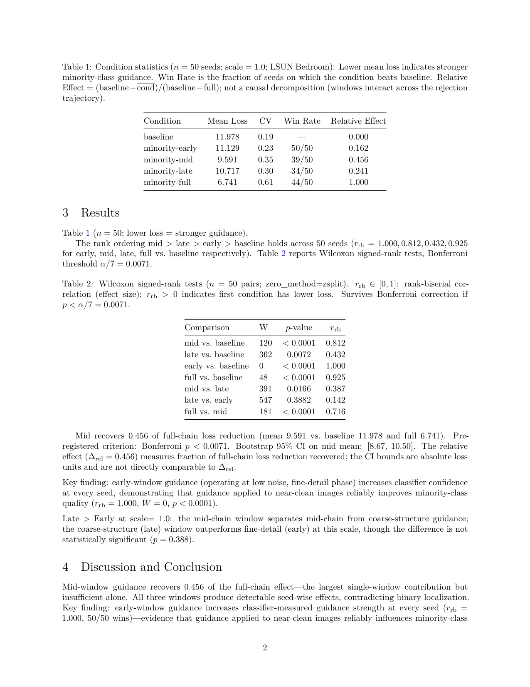
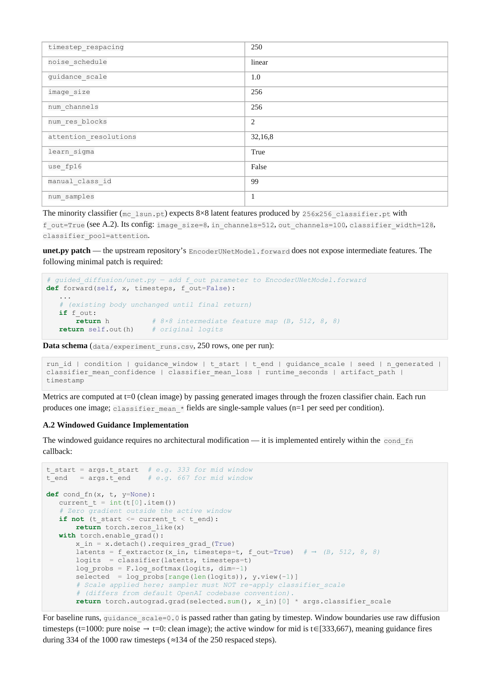
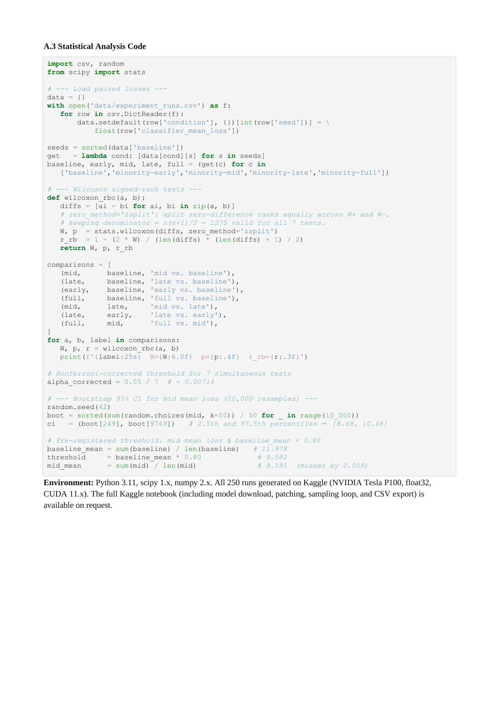

# Windowed Minority Guidance: Preliminary Evidence for Timestep-Localized Effects in Diffusion Denoising

**Vittoria Lanzo** · Independent Researcher

*Accepted at EEML 2026*

---

Minority guidance (Um et al., 2024) steers diffusion sampling toward under-represented data
regions via a classifier gradient at every denoising timestep. We test whether this effect is
timestep-localized, comparing three equal-thirds windows (early: t∈[0,333), mid: t∈[333,667),
late: t∈[667,1000)) against full-chain and no-guidance baselines over 50 seeds on LSUN Bedroom
(250 runs). Mid recovers 0.456 of full-chain loss reduction; Wilcoxon tests confirm effects for
mid, early, full vs. baseline (all p < 0.001), with late vs. baseline narrowly missing correction
(p = 0.0072 vs. α/7 = 0.00714). All windows produce detectable effects: preliminary evidence for
mid-chain dominance without strict localization. All measurements use guidance_scale=1.0;
Um et al. (2024) report at 3.5, and generalization to that scale requires validation.

---

## Results Summary

| Condition | Mean Loss | Win Rate | Relative Effect |
|---|---|---|---|
| baseline | 11.978 | N/A | 0.000 |
| minority-early | 11.129 | 50/50 | 0.162 |
| minority-mid | 9.591 | 39/50 | 0.456 |
| minority-late | 10.717 | 34/50 | 0.241 |
| minority-full | 6.741 | 44/50 | 1.000 |

Mid, early, and full guidance versus baseline all reach p < 0.001 (Wilcoxon signed-rank on 50
paired seeds, Bonferroni threshold α/7 ≈ 0.00714); late versus baseline (p = 0.0072) narrowly
misses correction.

---

## Extended abstract






📄 [windowed-minority-guidance.pdf](./windowed-minority-guidance.pdf) · [WMG.preliminary.pdf](./paper/WMG.preliminary.pdf) · [WMG.preliminary.tex](./paper/WMG.preliminary.tex) (LaTeX source)

## Reproduce

🔗 [windowed-minority-guidance-experiment](https://www.kaggle.com/code/vittorialanzo/windowed-minority-guidance-experiment)

Run at guidance_scale=1.0. Um et al. (2024) report results at guidance_scale=3.5; the windowed
effects measured here may not generalize to the published scale and require validation there.

---

## Keywords

minority guidance, classifier-guided diffusion, windowed guidance, DDPM, LSUN Bedroom,
inference-time guidance, timestep localization, guided diffusion sampling

---

## Citation

```bibtex
@misc{lanzo2026windowed,
  title  = {Windowed Minority Guidance: Preliminary Evidence for Timestep-Localized Effects in Diffusion Denoising},
  author = {Vittoria Lanzo},
  year   = {2026},
  note   = {Extended abstract, EEML 2026},
  url    = {https://github.com/VittoriaLanzo/windowed-minority-guidance}
}
```

## References

```bibtex
@inproceedings{dhariwal2021diffusion,
  title     = {Diffusion Models Beat {GAN}s on Image Synthesis},
  author    = {Prafulla Dhariwal and Alexander Nichol},
  booktitle = {Advances in Neural Information Processing Systems},
  year      = {2021}
}

@inproceedings{ho2020denoising,
  title     = {Denoising Diffusion Probabilistic Models},
  author    = {Jonathan Ho and Ajay Jain and Pieter Abbeel},
  booktitle = {Advances in Neural Information Processing Systems},
  year      = {2020}
}

@inproceedings{meng2022sdedit,
  title     = {{SDEdit}: Guided Image Synthesis and Editing with Stochastic Differential Equations},
  author    = {Chenlin Meng and Yutong He and Yang Song and Jiaming Song and Jiajun Wu and Jun-Yan Zhu and Stefano Ermon},
  booktitle = {International Conference on Learning Representations},
  year      = {2022}
}

@inproceedings{um2024dont,
  title     = {Don't Play Favorites: Minority Guidance for Diffusion Models},
  author    = {Soobin Um and Suhyeon Lee and Jong Chul Ye},
  booktitle = {International Conference on Learning Representations},
  year      = {2024}
}
```

---

> **Timestep Convention.** In DDPM, the reverse (denoising) process runs from t=T **down** to
> t=0. Therefore t=1000 corresponds to the very first denoising step (near-pure noise, coarse
> structure formation) and t=0 corresponds to the final step (clean image, fine-detail
> refinement). Concretely:
>
> | Window | t range | Noise level | Denoising phase |
> |--------|---------|-------------|-----------------|
> | early  | [0, 333)   | low  | fine-detail refinement |
> | mid    | [333, 667) | intermediate | semantic layout |
> | late   | [667, 1000) | high | coarse structure |
>
> The "early" window therefore operates at **low noise** (late in denoising time) and the "late"
> window at **high noise** (early in denoising time). Window names follow the t-axis order used
> in the paper, not the temporal order of denoising steps.
